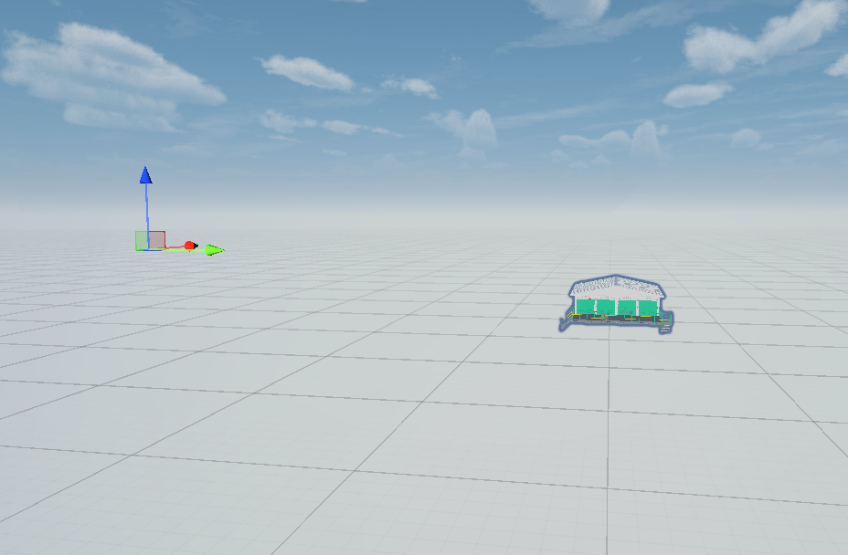
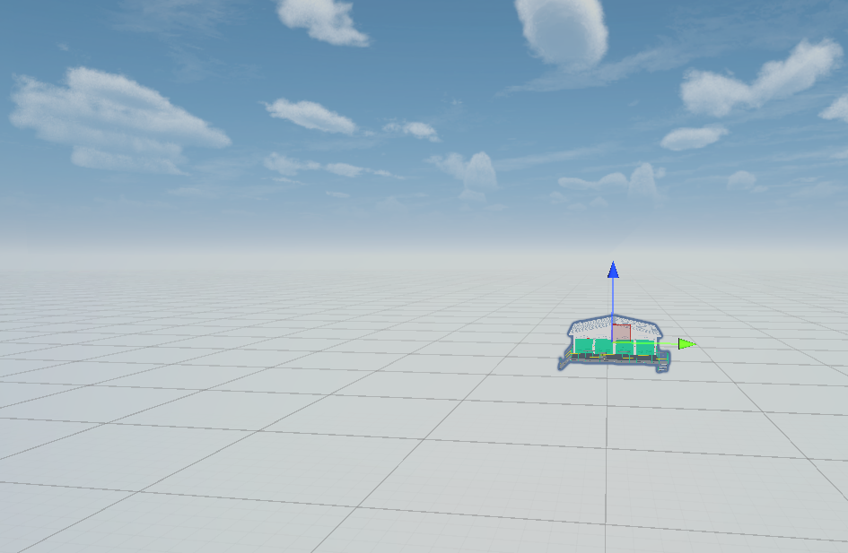

# Unity Mesh Tools

A small collection of Unity Editor tools for working with meshes.

## ✨ Features

### 🔹 Combine Child Meshes By Color
- Combines all child meshes of a selected GameObject.
- Groups submeshes by **shader + color**.
- Creates a new combined mesh with separate submeshes for each unique color.
- Automatically saves the result as an asset in `Assets/Meshes`.
- Very useful when importing complex models with deep hierarchies (e.g. from **Autodesk Navisworks Manage**).

### 🔹 Center Pivot Tool
- Re-centers the pivot of a mesh to the **geometric center** of its bounds.
- Updates vertices so the pivot moves without changing world position.

---

## 🚀 Usage
1. Copy scripts into your Unity project's `Editor` folder.
2. Access the tools from the **Tools** menu in Unity:
   - `Tools/Combine Child Meshes By Color`
   - `Tools/Center Pivot Tool`
3. Follow the console messages for results.

---

## 📊 Example

### Before
Imported model with a **deep hierarchy** and hundreds of small mesh parts.

### After
All child meshes combined into a **single mesh**, grouped by material color.  
Pivot recentered for easier manipulation.

---

## 📌 Notes
- Designed for quick mesh cleanup and optimization inside Unity Editor.
- Especially useful for preparing imported assets with complex hierarchies for AR/VR, games, or procedural workflows.
